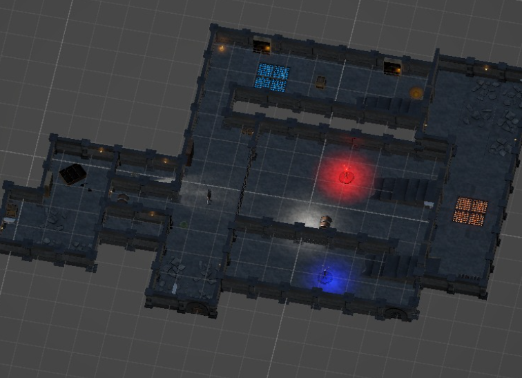
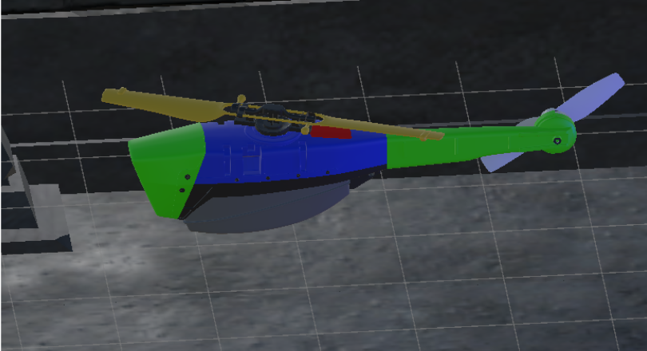
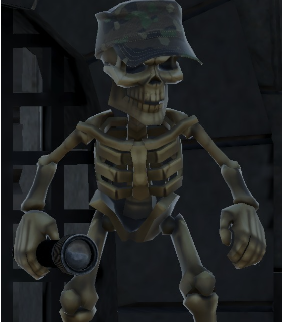
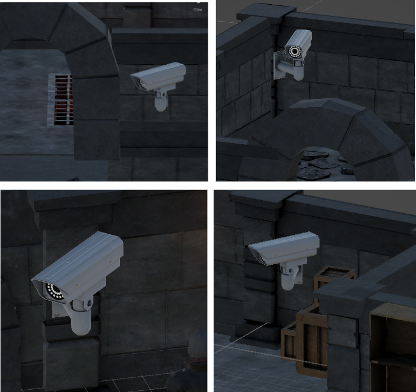
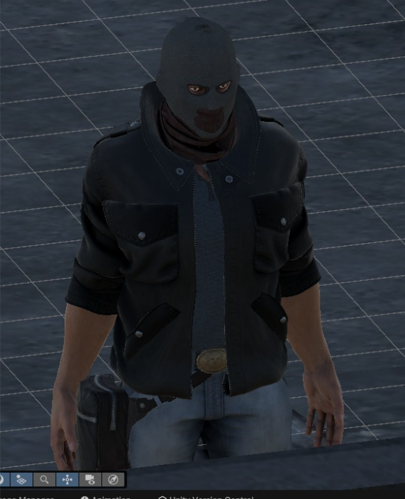

# Prison Security Multi-Agent System

A multi-agent simulation system developed in Unity and Python that models interactions between autonomous drones, security cameras, and security personnel in a prison environment. This project was developed by Team Warlocks at Tecnológico de Monterrey.

## 🎯 Project Overview

This system simulates a prison security environment where:
- An autonomous drone performs aerial patrols
- Fixed security cameras monitor designated areas
- Security personnel (represented by a skeleton) supervises and responds to alerts
- The system can detect and respond to suspicious activities

## 🖼️ Environment & Agents

### Virtual Environment


A dark-themed prison environment with UV-mapped textures, creating an atmospheric and challenging surveillance scenario.

### Security Drone


Autonomous drone that performs aerial patrols and responds to security alerts in real-time.

### Security Guard


Skeletal security personnel that monitors the surveillance system and can take manual control of the drone when needed.

### Security Cameras


Fixed surveillance cameras that monitor designated areas and detect suspicious activities.

### Intruder


Potential threats that the security system must detect and respond to.

## 🛠️ Prerequisites

- Unity (Latest LTS version recommended)
- Python 3.8+
- Required Python packages:
  ```bash
  pip install agentpy numpy opencv-python flask socket threading json logging
  ```

## 🚀 Installation & Setup

1. Download and Extract Project:
   - Download the project from [Google Drive](https://drive.google.com/drive/folders/1DxrSCH2N2o1mYsjl2kHfD6g_rXp5eCir?usp=sharing)
   - Extract the downloaded ZIP file to your desired location

2. Clone the repository (if you prefer using Git):
   ```bash
   git clone https://github.com/Aaron3312/ProyectoDronUnity.git
   ```

3. Open the project in Unity:
   - Launch Unity Hub
   - Add the project from the extracted directory
   - Open the project

4. Navigate to the Python scripts location:
   ```bash
   cd Assets/pycodes
   ```

5. Install Required Python Dependencies:
   ```bash
   pip install -r requirements.txt
   ```

## 💻 Running the System

1. First, start the Python agents in separate terminals:
   ```bash
   python CameraController.py
   python controller4.py
   python SecurityAgentControl.py
   python StaticCameras.py
   ```

2. Launch the Unity scene:
   - Open Unity
   - Load the main scene
   - Load the dungeon Scene
   - Click the Play button

## 🎮 System Components

- **Drone Agent**: Performs autonomous patrols and responds to alerts
- **Fixed Cameras**: Monitor areas and detect suspicious movements
- **Security Personnel**: Supervises alerts and can take manual control of the drone
- **Virtual Environment**: Dark-themed prison environment with UV-mapped textures

## 👥 Contributors

- Aarón Hernández Jiménez (ITC | A01642529)
- Christian Fernando Aguilera Santos (ITC | A01643407)
- Maxime Parienté (ITC | A01764161)
- Pablo Esteban Reyes (ITC | A01643307)
- Luis Marco Barriga Baez (ITC | A01643954)
- Aram Barsegyan (ITC | A01642781)

## 📝 License

This project is part of the TC2008B course at Tecnológico de Monterrey, Campus Guadalajara.
